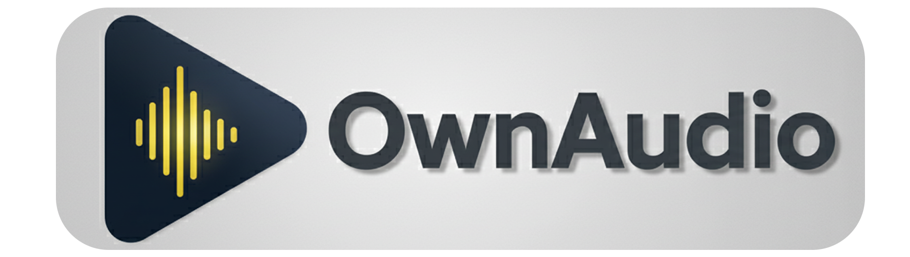

<div align="center">
  
</div>

<a href="https://www.buymeacoffee.com/ModernMube">
  
</a>

##

Ownaudio is a cross-platform C# audio library that provides a high-level API for audio playback, recording, and processing. By default, it uses FFmpeg for audio decoding and PortAudio for audio I/O. If ffmpeg or portaudio is not installed, it automatically substitutes the missing one for Miniaudio. This way, it can work without any external dependencies using Miniaudio. The implementation of Miniaudio also allowed the API to be used on mobile platforms.

## Features

- **Cross-platform** compatibility (Windows, macOS, Linux, Android, Ios)
- **Audio playback** with support for various formats via FFmpeg, or miniaudio (mp3, wav, flac) formats.
- **Audio recording** capabilities through input devices
- **Time stretching and pitch shifting** using SoundTouch
- **Mixing** multiple audio sources
- **Volume control** and custom audio processing
- **Seeking** within audio files
- **Real-time audio processing** with custom sample processors
- **Audio data visualize** customizable waveform display

## Documentation

 <a href="../../wiki/OwnAudio-first-steps">
  
</a>

<a href="../../wiki/How-to-use-OwnAudio's-built‐in-effects">
  
</a>

<a href="../../wiki/OwnAudio-Library-Documentation">
  
</a>

<a href="../../wiki/Ownaudio-SourceManager-Class-Documentation">
  
</a>

<a href="../../wiki/Ownaudio-Source-Class-Documentation">
  
</a>

<a href="../../wiki/Ownaudio-Real-Time-Source-Class-Documentation">
  
</a>

## Supported Systems

The table below summarizes the supported operating systems, the APIs used, and their testing status.

| System     | APIs                           | Status       |
|------------|--------------------------------|--------------|
| Windows    | Portaudio 2, Miniaudio, Ffmpeg 6 | Tested       |
| Linux      | Portaudio 2, Miniaudio, Ffmpeg 6 | Not tested   |
| MacOs      | Portaudio 2, Miniaudio, Ffmpeg 6 | Tested       |
| Android    | Miniaudio                      | Not tested   |
| Ios        | Miniaudio                      | Not tested   |

The library will attempt to find these dependencies in standard system locations but also supports specifying custom paths.

## Installation

You can add this library to your project via NuGet (when published) or by directly referencing the project.

## Optional dependencies: Portaudio and FFmpeg

By default, our code includes **Miniaudio**, which is ready to use for all systems, so you can get started right away!

If you want to use **Portaudio** and **FFmpeg** on certain platforms for extended functionality, you can configure them as follows:

### Windows

1. Grab the **FFmpeg 6** files and extract them to a folder.

2. Copy the **Portaudio 2** DLL file to the same folder.

3. When you initialize `OwnAudio` in your code, just point to the folder path.

### Linux

1. Use Synaptic package manager (or your distribution's equivalent) to install `portaudio19-dev` (this usually provides Portaudio v2) and `ffmpeg` (version 6 or compatible).
* For example, on Debian/Ubuntu based systems:

```bash
sudo apt update
sudo apt install portaudio19-dev ffmpeg

```
(Note: Package names may vary slightly depending on your Linux distribution. Make sure you get libraries compatible with FFmpeg version 6.)

2. `OwnAudio` is smart and will automatically find and use them if they are installed systemwide.

### macOS

1. Launch the terminal and use Homebrew:

```bash
brew install portaudio
brew install ffmpeg@6

```
2. After installation, the code will automatically detect and prioritize Portaudio and FFmpeg.

### Android and iOS

* Good news! **Miniaudio** works out of the box on Android and iOS. These platforms don't require any additional steps to handle audio.

---

## Basic Usage

Here's a quick example of how to use Ownaudio to play an audio file:

```csharp
using Ownaudio;
using Ownaudio.Sources;
using System;
using System.Threading;

// Initialize Ownaudio
OwnAudio.Initialize();

// Create a source manager
var sourceManager = SourceManager.Instance;

// Add an audio file
await sourceManager.AddOutputSource("path/to/audio.mp3");

// Play the audio
sourceManager.Play();

// Wait for the audio to finish
Console.WriteLine("Press any key to stop playback...");
Console.ReadKey();

// Stop playback and clean up
sourceManager.Stop();
OwnAudio.Free();
```

## Advanced Features

### Mixing Multiple Audio Sources

```csharp
// Add multiple audio files
await sourceManager.AddOutputSource("path/to/audio1.mp3");
await sourceManager.AddOutputSource("path/to/audio2.mp3");

// Adjust volume for individual sources
sourceManager.SetVolume(0, 0.8f);  // 80% volume for first source
sourceManager.SetVolume(1, 0.6f);  // 60% volume for second source

// Play mixed audio
sourceManager.Play();
```

### Audio Recording

```csharp
// Add an input source
await sourceManager.AddInputSource();

// Start recording
sourceManager.Play("output.wav", 16);  // 16-bit recording
```

### Time Stretching and Pitch Shifting

```csharp
// Change tempo without affecting pitch (value range -20 to +20)
sourceManager.SetTempo(0, 10.0);  // Speed up by 10%

// Change pitch without affecting tempo (value range -6 to +6 semitones)
sourceManager.SetPitch(0, 2.0);  // Raise pitch by 2 semitones
```

### Seeking Within Audio

```csharp
// Seek to a specific position
sourceManager.Seek(TimeSpan.FromSeconds(30));  // Seek to 30 seconds
```

## Audio Processing

You can implement custom audio processing by implementing the `SampleProcessorBase` class:

```csharp
public class MyAudioProcessor : SampleProcessorBase
{
    public override void Process(Span<float> samples)
    {
        // Process audio samples
        for (int i = 0; i < samples.Length; i++)
        {
            // Example: Simple gain adjustment
            samples[i] *= 0.5f;  // 50% volume
        }
    }
}

// Apply the processor to a source or source manager
var processor = new MyAudioProcessor();
sourceManager.CustomSampleProcessor = processor;
```

## Audio Data Read

```csharp
// We load the source audio data into a byte array.
byte[] audioByte = sourceManager.Sources[0].GetByteAudioData(TimeSpan.Zero);

// We load the source audio data into a float array.
float[] audioFloat = sourceManager.Sources[0].GetFloatAudioData(TimeSpan.Zero);
```

## WaveAvaloniaDisplay

A flexible, resource-efficient audio waveform visualization component for Avalonia applications.

## Key Features

- **Multiple display styles:** MinMax (classic waveform), Positive (half-wave rectified), or RMS (energy representation)
- **Zoom in/out:** Supports zooming for detailed audio inspection
- **Interactive playback position:** Users can change the playback position by clicking or dragging
- **Customizable appearance:** Colors and scaling are fully customizable
- **Optimized performance:** Minimal resource usage even with large audio files

## Usage

The following example demonstrates how to use the `WaveAvaloniaDisplay` component in an Avalonia application:

```xml
<Window xmlns="https://github.com/avaloniaui"
        xmlns:x="http://schemas.microsoft.com/winfx/2006/xaml"
        xmlns:audio="using:Ownaudio.Utilities"
        x:Class="MyAudioApp.MainWindow"
        Title="Audio Visualizer" Height="450" Width="800">

    <Grid>
        <audio:WaveAvaloniaDisplay x:Name="waveformDisplay"
                                WaveformBrush="DodgerBlue"
                                PlaybackPositionBrush="Red"
                                VerticalScale="1.0"
                                DisplayStyle="MinMax"/>
    </Grid>
</Window>
```

## C# code

```csharp
waveformDisplay.SetAudioData(SourceManager.Instance.Sources[0].GetFloatAudioData(TimeSpan.Zero));
waveformDisplay.PlaybackPositionChanged += OnPlaybackPositionChanged;
```

## Properties

| Property | Type | Description |
|----------|------|-------------|
| WaveformBrush | IBrush | The color of the waveform |
| PlaybackPositionBrush | IBrush | The color of the playback position indicator |
| VerticalScale | double | Vertical scaling of the waveform (1.0 = original size) |
| DisplayStyle | WaveformDisplayStyle | The waveform display style (MinMax, Positive, RMS) |
| ZoomFactor | double | Zoom factor (1.0 = full view, larger values = more detailed view) |
| ScrollOffset | double | Horizontal scroll position (0.0 - 1.0) |
| PlaybackPosition | double | Current playback position (0.0 - 1.0) |

## Events

| Event | Parameter | Description |
|-------|-----------|-------------|
| PlaybackPositionChanged | double | Triggered when the user changes the playback position |

## Architecture

The library follows a layered architecture:

1. **Native Libraries** (FFmpeg & PortAudio) - Low-level audio I/O and decoding
2. **Decoders** - Audio file decoding (FFmpegDecoder)
3. **Sources** - Audio source management (Source, SourceInput)
4. **SourceManager** - Mixing and controlling multiple sources
5. **Processors** - Custom audio processing pipeline

## Support My Work

If you find this project helpful, consider buying me a coffee!

<a href="https://www.buymeacoffee.com/ModernMube" 
    target="_blank">
 </a>

## Acknowledgements

Special thanks to the creators of the following repositories, whose code was instrumental in the development of Ownaudio:

- [Bufdio](https://github.com/luthfiampas/Bufdio) - Audio playback library for .NET
- [FFmpeg.AutoGen](https://github.com/Ruslan-B/FFmpeg.AutoGen) - FFmpeg auto generated unsafe bindings for C#/.NET
- [soundtouch.net](https://github.com/owoudenberg/soundtouch.net) - .NET wrapper for the SoundTouch audio processing library
- [Avalonia](https://github.com/AvaloniaUI/Avalonia) - Cross-platform .NET UI framework
- [SukiUI](https://github.com/kikipoulet/SukiUI) - Modern UI toolkit for Avalonia
