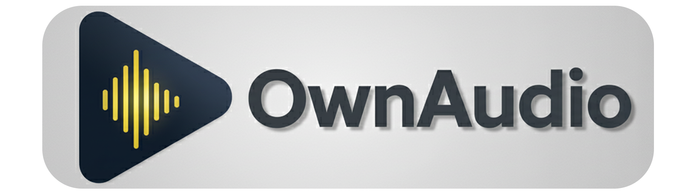

<div align="center">
    
</div>

<div align="center">
  <a href="https://www.nuget.org/packages/OwnAudioSharp">
    
  </a>
  <a href="https://www.buymeacoffee.com/ModernMube">
    
  </a>
</div>


<div align="center">
  <a href="https://modernmube.github.io/OwnAudioSharp">
    
  </a>
  <a href="https://github.com/ModernMube/OwnAudioSharp/tree/master/OwnAudio/Examples">
    
  </a>
</div>

##

## What is OwnAudioSharp?

**OwnAudioSharp** is a cross-platform C# audio framework that gives developers professional-grade audio capabilities with a single, easy-to-use API — no native audio expertise required.

The library is built on a native C++ engine (PortAudio / MiniAudio) backed by a fully managed C# layer. The result is GC-free, dropout-free, real-time audio on Windows, macOS, Linux, Android, and iOS — all from one NuGet package.

Built-in decoders cover **MP3, WAV, and FLAC** out of the box. When **FFmpeg 8+** is installed on the system, OwnAudioSharp automatically uses it as the primary decoder — expanding support to AAC, OGG, Opus, WMA, AIFF, AC3, and virtually any other format with no API changes required.

---

> ## 🚧 Major Architecture Evolution in Progress
>
> **A new branch is under active development that fundamentally reimagines the OwnAudioSharp engine.**
>
> Despite every effort to keep the managed API allocation-free, one hard truth remains: if the code *calling* the API allocates — and virtually all real-world C# code does — the .NET garbage collector will eventually pause it. Even a single GC pause of a few milliseconds is enough to produce an audible dropout in a real-time audio stream. No amount of API-level discipline can fully shield the audio thread from the GC that owns the entire process.
>
> **The decision has been made to rewrite the entire audio engine in Rust.**
>
> Rust delivers deterministic, GC-free execution with the same memory and thread-safety guarantees as managed code — enforced at compile time, not at runtime. A thin, audio-agnostic C# layer will remain as the public surface, bridging your application code to the native engine with zero overhead and zero managed allocations on the hot path.
>
> ### Core design principle: managed code never touches audio data
> Every operation that processes, transforms, or moves audio samples is implemented exclusively in Rust. The managed C# layer handles configuration, control flow, and application logic — but **no audio data ever passes through managed code**. This is the fundamental guarantee that makes GC-pause-free real-time audio possible on .NET.
>
> Our primary goal is to give C# developers a genuinely usable, efficient, and cross-platform audio API — one that does not require native audio expertise and does not compromise on real-time performance.
>
> ### What changes under the hood
> - The audio engine runs as native Rust code, completely outside the .NET runtime and its GC
> - **All audio data processing happens in Rust** — managed code is never involved in the audio path
> - Memory safety and data-race freedom are guaranteed by the Rust compiler — no runtime checks, no overhead
> - The **MiniAudio** and **PortAudio** third-party dependencies are removed; the engine ships everything it needs
> - Startup, latency, and stability characteristics will improve across all platforms
>
> ### What stays exactly the same
> - **The OwnAudioSharp public API is unchanged** — your existing code will continue to compile and run without modification
> - Distribution remains a single NuGet package — one `dotnet add package` and you're done
> - All supported platforms (Windows, macOS, Linux, Android, iOS) remain fully supported
>
> ### One important API change: VocalRemover moves to a separate package
> The **VocalRemover** (AI stem separation) feature will be removed from the core `OwnAudioSharp` package and released as a dedicated external package. This keeps the core package lean and focused on audio I/O, while giving users who need AI separation an opt-in dependency. Migration will require only a package reference change — the API surface stays the same.
>
> *Follow the development branch for updates. Contributions and early feedback are welcome.*

---

### What it offers out of the box

| Category | Capability |
|---|---|
| Playback & Mixing | Multi-track sync, real-time tempo/pitch, per-track volume |
| Recording | Low-latency capture with device selection |
| Effects | 15 real-time DSP effects (reverb, EQ, compressor, limiter, …) |
| AI / ML | Vocal separation (HTDemucs 4-stem), reference mastering, chord detection |
| MIDI | Hardware I/O, SMF file read/write, hardware-accurate clock |
| Network | Sample-accurate multi-device sync over LAN |
| Plugins | VST3 effect plugins with cross-platform editor GUI |
| Calibration | SmartMaster speaker calibration with automatic EQ correction |

### Recommended for

- **Music players and DAWs** — synchronized multitrack playback with full effect processing
- **Karaoke and stem apps** — AI vocal/instrument separation and real-time mixing
- **DJ software** — tempo/pitch control, network sync, VST3 effects
- **Music education tools** — chord recognition, MIDI capture, score generation
- **Broadcast and podcast tools** — reference mastering, dynamic processing, automatic room calibration
- **Live performance apps** — network-synchronized multi-room or multi-device setups
- **Games and interactive audio** — low-latency output, real-time effect chains

## Installation

Three packages are available depending on your platform and feature needs:

| Package | Platforms | AI/ML | Package size |
|---|---|---|---|
| `OwnAudioSharp` | Windows, Linux, macOS | ✅ Full | ~20 MB |
| `OwnAudioSharp.Basic` | All platforms | ❌ None | < 7 MB |

> **AI model files** (best, default, karaoke, htdemucs ONNX models, total ~272 MB) are **not bundled** in the NuGet package. They are downloaded automatically on first use via `VocalRemoverModelManager.DownloadModelAsync()` and stored in the user's local application data folder.

```bash
dotnet add package OwnAudioSharp          # Desktop, full features
dotnet add package OwnAudioSharp.Mobile   # Mobile, full features
dotnet add package OwnAudioSharp.Basic    # Lightweight, no AI/ML
```

**Requirement:** .NET 10.0 or later. PortAudio can be installed system-wide for optimal audio quality; otherwise the bundled MiniAudio backend is used automatically.

> **FFmpeg (optional):** If FFmpeg 8+ dynamic libraries (`avcodec`, `avformat`, `avutil`, `swresample`) are installed on the system, OwnAudioSharp automatically uses them as the primary decoder — giving you support for virtually any audio format (AAC, OGG, Opus, WMA, AIFF, and more) without any API changes. If FFmpeg is not found, the built-in MP3/WAV/FLAC decoders are used as a seamless fallback. FFmpeg is **not** required and is **not** bundled with the package.

---

## Features

### Multi-Track Synchronized Playback
Play multiple audio files in perfect sync using a shared central clock. Each track supports individual volume, pitch, and tempo control — ideal for DAW-style applications or multitrack players.

### Real-Time Tempo & Pitch Control
Adjust playback speed and pitch independently, in real time, even across multiple tracks simultaneously. Uses the SoundTouch engine under the hood.

### 15 Real-Time DSP Effects
Apply reverb, equalizer, compressor, limiter, chorus, delay, distortion, and more to inputs or outputs. Effects are freely combinable and can be inserted per-track or on the master bus.

### VST3 Plugin Support
Load VST3 audio effect plugins and use their native cross-platform editor GUI. Integrates into the effect chain the same way as built-in effects.

### Simple Recording & Playback
Straightforward API for audio capture from any input device with configurable sample rate, buffer size, and channel count.

### SmartMaster — Automatic Speaker Calibration
Measures your speakers using a microphone and automatically corrects the audio output for optimal sound quality. Includes built-in speaker profiles (HiFi, Headphone, Studio, Club, Concert), a 31-band EQ, multiband compression, and a brick-wall limiter.

**Good for:** room correction, broadcast preparation, professional mastering chains.

### NetworkSync — Multi-Device Audio Synchronization
Synchronizes audio playback across multiple devices on the local network with sample-accurate precision (< 5 ms on LAN). Zero-configuration with automatic server discovery.

**Good for:** multi-room audio, live PA setups, museum installations, collaborative production.

### Audio Matchering — Reference-Based Mastering
Analyzes a reference track and applies its spectral and dynamic characteristics to your audio. Delivers professional mastering results without expensive external plugins.

**Good for:** music production, podcast finishing, audio restoration.

### Vocal Remover — AI Stem Separation
Separates audio into vocals and instruments (or full 4-stem: vocals, drums, bass, other) using ONNX neural networks. Features the **HTDemucs** model for high-quality stem isolation with margin-trimming to eliminate chunk-boundary artifacts.

<div align="center">
  <a href="https://huggingface.co/ModernMube/HTDemucs_onnx/tree/main">
    
  </a>
</div>

The **Multi-Model Pipeline** runs several UVR MDX models in parallel and averages their outputs for superior separation quality with fewer artifacts. Available models: `htdemucs` (4-stem), `default`, `best`, `karaoke`.

> **Model download:** ONNX model files are not bundled in the NuGet package. Call `VocalRemoverModelManager.DownloadModelAsync()` to fetch a model on first use — it is saved to the user's local application data folder and reused automatically afterward. Custom model paths are also supported via `SimpleSeparationOptions.ModelPath`.

**Good for:** karaoke creation, remixing, instrumental extraction, stem mastering.

### Chord Detection — Real-Time Musical Analysis
Recognizes major, minor, diminished, augmented, and extended chords (7th through 13th) from audio in real time or offline. Uses a chromagram-based analysis pipeline.

**Good for:** music transcription, chord chart generation, music education, DJ software.

### MIDI — Hardware I/O, Files, and Clock

> See the full API reference: [OwnAudio/Midi/README.md](OwnAudio/Midi/README.md)

AOT-compatible, reflection-free MIDI library supporting Windows (WinMM), macOS (CoreMIDI), and Linux (ALSA rawmidi). Features real-time MIDI input/output, Standard MIDI File (SMF format 0/1) read/write/edit, and a hardware-accurate 24 PPQN MIDI clock.

**Good for:** sequencers, virtual instruments, MIDI recorders, hardware sync.

---

## Engine Architecture

OwnAudioSharp uses a two-layer architecture:

```
Application
  └─ OwnaudioNet (high-level API)
       └─ AudioEngineWrapper (lock-free, non-blocking)
            └─ NativeAudioEngine (C++ PortAudio / MiniAudio)
                 └─ Audio hardware
```

- **[Ownaudio.Core](OwnAudioEngine/Ownaudio.Core/README.md)** — platform-agnostic interfaces, managed MP3/WAV/FLAC decoders, lock-free ring buffers, SIMD converters, and object pools.
- **[Ownaudio.Native](OwnAudioEngine/Ownaudio.Native/README.md)** — cross-platform native engine (PortAudio + MiniAudio fallback) for Windows, Linux, macOS, Android, and iOS.

All blocking engine methods (`Initialize`, `Stop`, `Send`) must be called off the UI thread. The high-level `OwnaudioNet` API handles threading internally.

---

## Documentation

Complete API reference, tutorials, and architecture guides are on the official website:

<div align="center">
  <a href="https://modernmube.github.io/OwnAudioSharp/">
    
  </a>
</div>

Working example projects are in the [OwnAudio/Examples/](OwnAudio/Examples/) directory.

---

## Support

**OwnAudioSharp is free and open-source.** If you use it in a commercial product or find it saves you time, consider supporting its development:

<div align="center">
  <a href="https://www.buymeacoffee.com/ModernMube" target="_blank">
    
  </a>
</div>

Your support funds new features, platform improvements, bug fixes, and documentation — and keeps professional audio tooling freely available to the .NET community.

Issues and feature requests: [GitHub Issues](https://github.com/modernmube/OwnAudioSharp/issues)

---

## License

See the [LICENSE](LICENSE) file for details.
