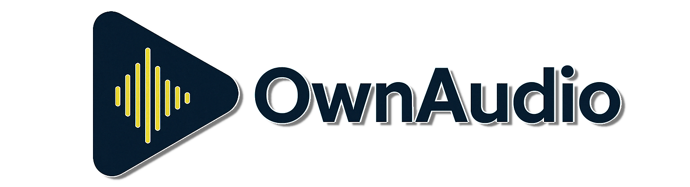

<div align="center">
  
</div>

<a href="https://www.buymeacoffee.com/ModernMube">
  
</a>

<a href="https://www.nuget.org/packages/OwnAudioSharp">
  
</a>

##

**OwnAudioSharp** is a **cross-platform managed audio engine** built entirely in C# with **zero external native dependencies**. It provides direct access to native system audio APIs (WASAPI, PulseAudio, Core Audio, AAudio) through pure managed code, offering professional-grade audio capabilities that are typically only found in commercial software - **completely free**.

### Why OwnAudioSharp?

**Pure Managed Code Engine**: No native library dependencies - runs anywhere .NET runs
**Professional Audio Features**: AI-driven vocal separation, audio mastering, advanced chord detection
**High Performance**: Zero-allocation design, lock-free buffers, SIMD optimization
**Commercial-Grade, Free**: Professional tools without licensing costs
**True Cross-Platform**: Windows, macOS, Linux, Android, iOS (in progress)

## ⚠️ Important Notice

**Version 2.0.0 introduces major improvements!**

Pre-2.0.0 versions relied on native libraries (miniaudio, portaudio, ffmpeg) and were less optimized. Starting from version 2.0.0, OwnAudioSharp operates with **zero external dependencies** using a fully managed audio engine.

**Key changes:**
- ✅ Fully managed audio engine across all platforms
- ✅ ~90% backward compatibility with previous API
- ✅ Significant performance improvements
- ⚠️ Legacy APIs marked as `[Obsolete]` - will be removed in future versions

**Using OwnaudioSharp version 2 with older code:**
If you need pre-2.0.0 functionality because you wrote your code for an older version of OwnaudioSharp, replace the **Ownaudio** namespaces in your code with the **OwnaudioLegacy** namespace.
for example: **Ownaudio.Source** => **OwnaudioLegacy.Source**

**Migration recommendation:** Use version 2.0.0 or later for all new projects. The new managed engine offers superior performance and maintainability.

## ✨ Key Features

### Professional Audio Features (Free!)

Features typically found only in commercial software:

- **AI Vocal Separation**: State-of-the-art vocal and instrumental track separation using ONNX neural networks
  - Multiple quality models: `default`, `best`, `karaoke`, `nmp`
  - Professional-grade stem isolation

- **Audio Mastering**: AI-driven matchering - master your tracks to match reference audio
  - Automatic EQ matching and spectral analysis
  - Professional mastering without expensive plugins

- **Advanced Chord Detection**: Musical chord recognition from simple to professional
  - Real-time and offline analysis
  - Major, minor, diminished, augmented, extended chords (7th, 9th, 11th, 13th)
  - Chromagram-based recognition

### Core Engine Features

- **Cross-platform Managed Engine**: Pure C# implementation for all platforms
  - Windows (WASAPI), macOS (Core Audio), Linux (PulseAudio), Android (AAudio), iOS (in progress)
  - No native library dependencies - works out of the box

- **Dual API Layers**:
  - Low-level Core API for direct engine control
  - High-level NET API for professional features

- **Audio Processing**:
  - Multi-format support (MP3, WAV, FLAC) with built-in decoders
  - Real-time effects: reverb, compressor, equalizer, pitch shifting, tempo control
  - Multi-source audio mixing with synchronized playback

- **High Performance**:
  - Zero-allocation design for real-time audio
  - Lock-free ring buffers for thread safety
  - SIMD-optimized audio processing

## 📦 Installation

### NuGet Package Manager
```powershell
Install-Package OwnAudioSharp
```

### .NET CLI
```bash
dotnet add package OwnAudioSharp
```

### Requirements
- .NET 9.0 or later
- No external dependencies

## 📚 Documentation & API Reference

**Complete API documentation with examples is available on the official website:**

<div align="center">
  <a href="https://modernmube.github.io/OwnAudioSharp/">
    
  </a>
</div>

The website includes:
- Complete API reference for all classes and methods
- Step-by-step tutorials and usage examples
- Architecture and design documentation
- Best practices and performance tips
- Professional feature guides (vocal removal, mastering, chord detection)

### 🔧 Engine Architecture Documentation

OwnAudioSharp's audio engine is built on a modular architecture with platform-specific implementations. Detailed documentation is available for each component:

#### Core Components
- **[Ownaudio.Core](OwnAudioEngine/Ownaudio.Core/README.md)** - Cross-platform interfaces, audio decoders (MP3/WAV/FLAC), lock-free buffers, and zero-allocation primitives

#### Platform-Specific Implementations
- **[Ownaudio.Windows](OwnAudioEngine/Ownaudio.Windows/README.md)** - WASAPI implementation for Windows (10+)
- **[Ownaudio.Linux](OwnAudioEngine/Ownaudio.Linux/README.md)** - PulseAudio implementation for Linux
- **[Ownaudio.macOS](OwnAudioEngine/Ownaudio.macOS/README.md)** - Core Audio implementation for macOS
- **[Ownaudio.Android](OwnAudioEngine/Ownaudio.Android/README.md)** - AAudio implementation for Android (API 26+)

Each platform implementation includes:
- Architecture overview and native API details
- Performance characteristics and latency information
- Platform-specific requirements and dependencies
- Usage examples and best practices
- Troubleshooting guides

For low-level engine development or platform-specific optimization, refer to the individual platform documentation.

## 🚀 Quick Start Example

```csharp
// Initialize OwnaudioNET (async for UI apps!)
await OwnaudioNet.InitializeAsync();

// Create file source
var source = new FileSource("music.mp3");

// Create mixer and add source
var mixer = new AudioMixer(OwnaudioNet.Engine);
mixer.AddSource(source);
mixer.Start();

// Play the source
source.Play();

// Apply professional effects
var reverb = new ReverbEffect { Mix = 0.3f, RoomSize = 0.7f };
var compressor = new CompressorEffect(threshold: 0.5f, ratio: 4.0f, sampleRate: 48000f);
var sourceWithEffects = new SourceWithEffects(source, reverb, compressor);

// Control playback
source.Volume = 0.8f;
source.Seek(30.0); // seconds
```

## 💡 Support the Project

**OwnAudioSharp is completely free and open-source**, providing professional-grade audio features without licensing costs. If you find this library useful, especially for commercial purposes, please consider supporting its continued development:

<div align="center">
  <a href="https://www.buymeacoffee.com/ModernMube" target="_blank">
    
  </a>
</div>

**Why support?**
- Enables continued development and new features
- Ensures timely bug fixes and updates
- Improves documentation and examples
- Saves you thousands in commercial audio library licensing costs

Your support helps keep professional audio technology accessible to everyone!

## 📄 License

See the [LICENSE](LICENSE) file for details.

## 🙏 Acknowledgements

Special thanks to the creators of:
- [DryWetMidi](https://github.com/melanchall/drywetmidi) - .NET library to work with MIDI data and MIDI devices
- [soundtouch.net](https://github.com/owoudenberg/soundtouch.net) - .NET wrapper for SoundTouch
- [Avalonia](https://github.com/AvaloniaUI/Avalonia) - Cross-platform .NET UI framework
